# cbse-cs-projects
Projects for CBSE Computer science students

# Homework Todo App

Main menu

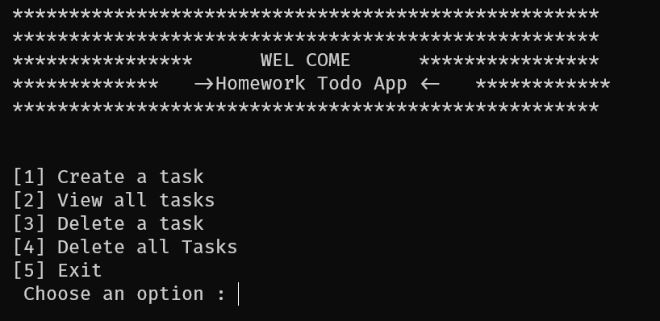

Choice 1 (Create Task)

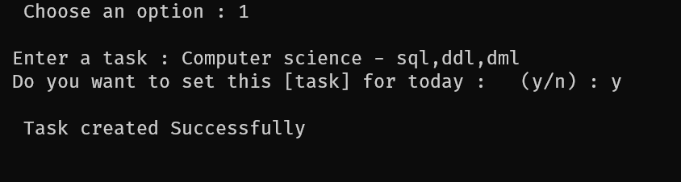

Choice 1 (if task is not set for today)

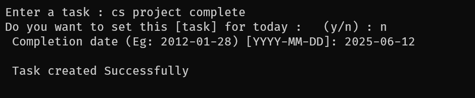

Choice 2 (View all tasks):

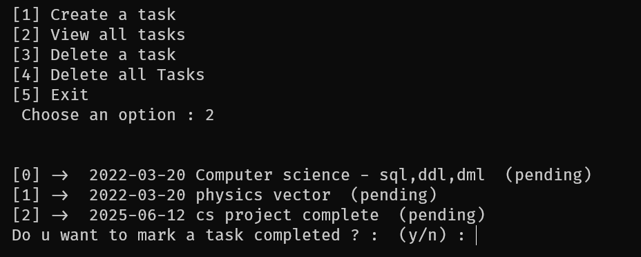

Set a task completed:

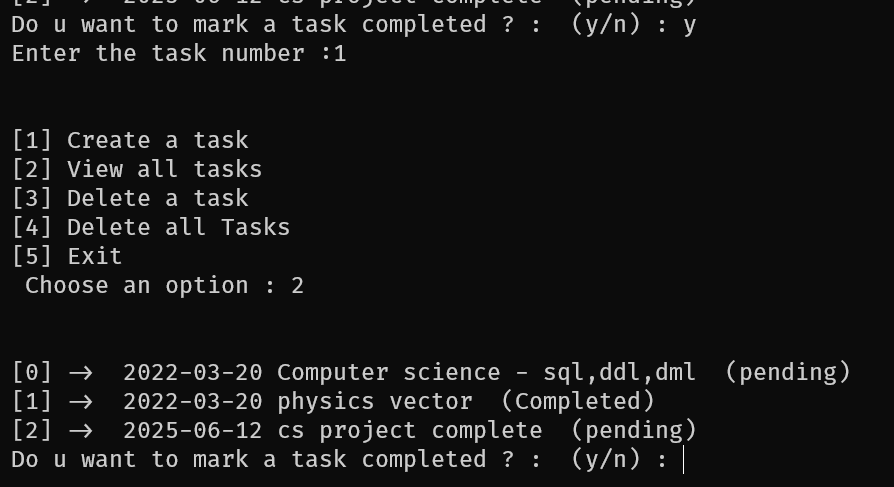

Choice 3 (Delete a task):

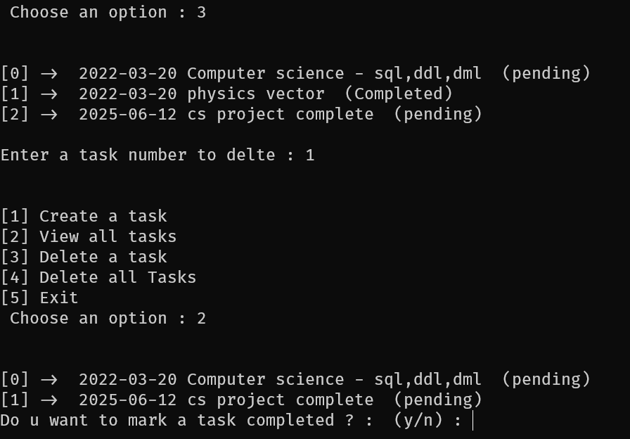

Choice 4 in main menu (Delete all task):

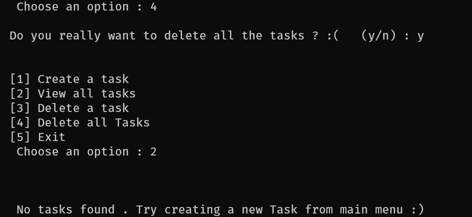

# Flight Ticket management System

Creation of database

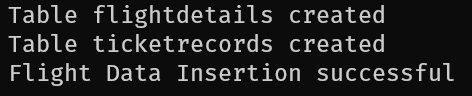

Main menu

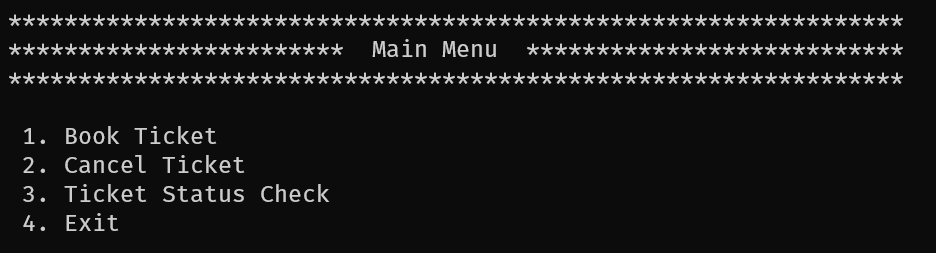{width="6.268055555555556in"
height="1.6944444444444444in"}

Choice 1 (Booking Menu)

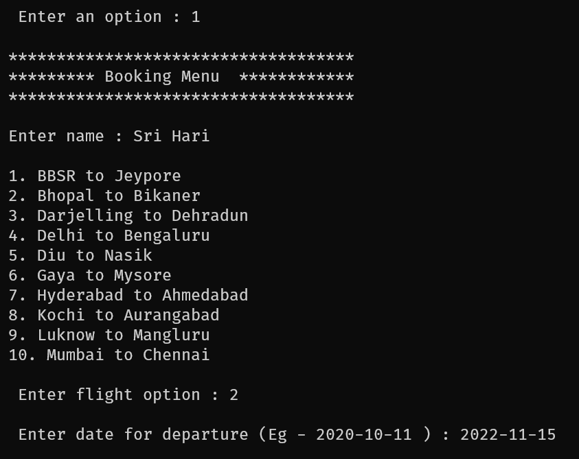

Flight details and selection of seat status menu

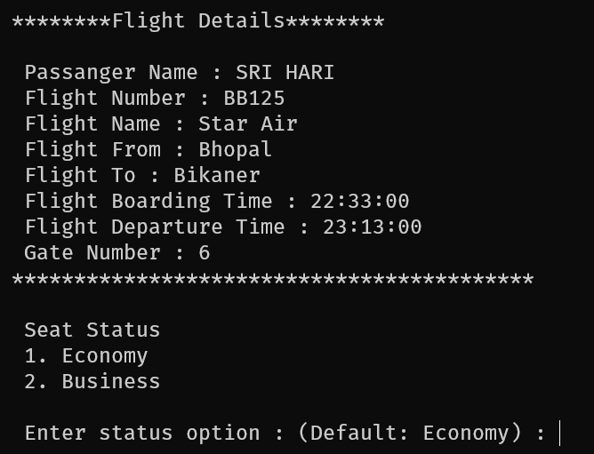

Ticket Confirmation:

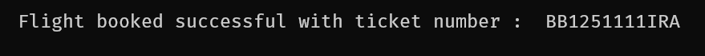

Choice 2 in main menu(Cancel Ticket):

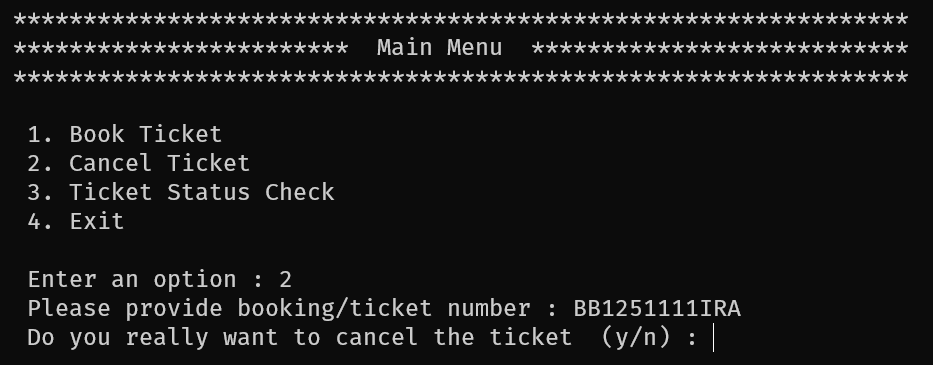

Choice 3 in main menu (Ticket status check):

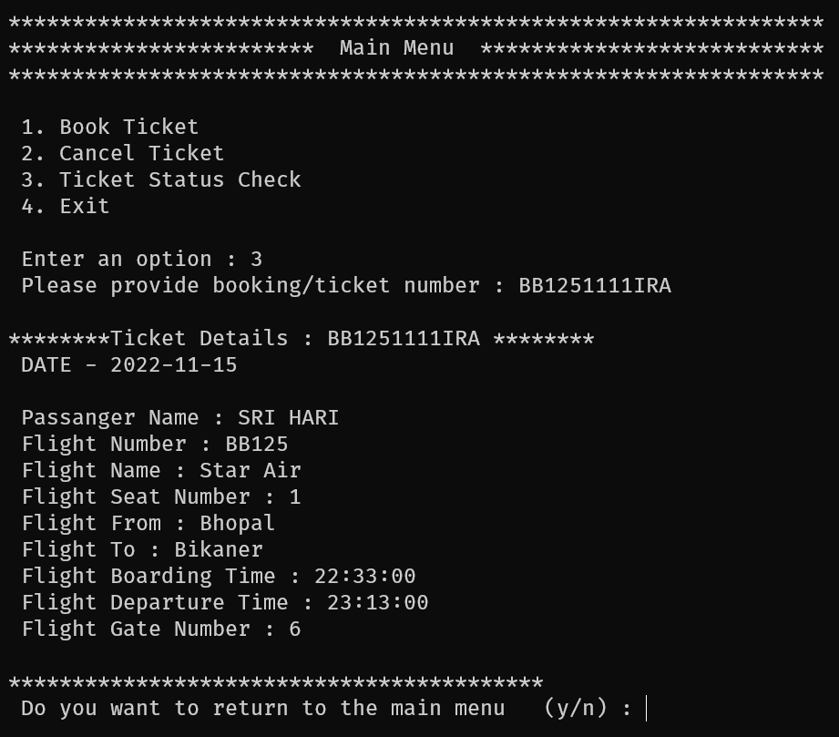

Choice 4 to exit program.

Ticketrecords.py output:

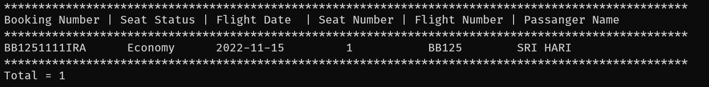

## Images for rest of the project are not included.